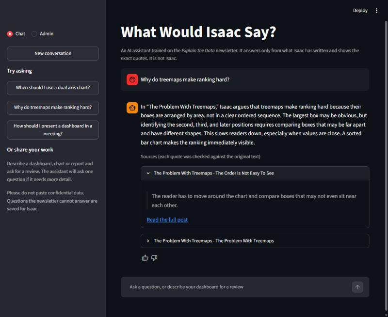
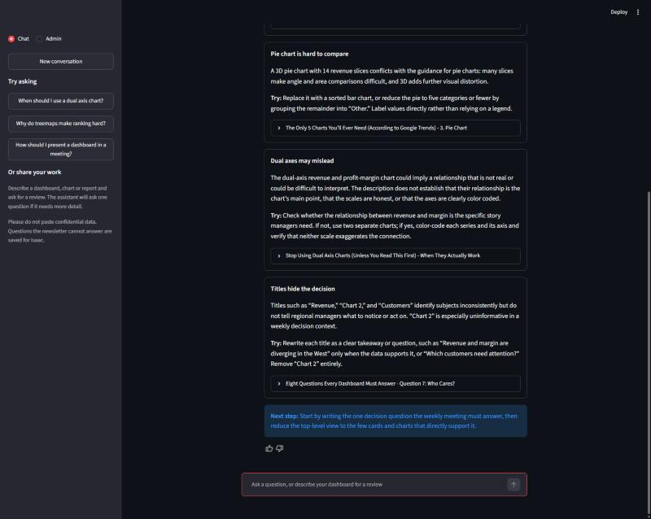
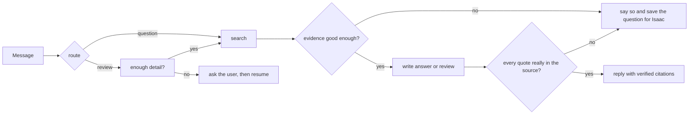

# What Would Isaac Say?

**A grounded AI assistant for the [Explain the Data](https://explainthedata.substack.com) newsletter.**
It answers questions using only what the newsletter says, proves every answer with quotes that code
has checked against the original text, reviews a reader's dashboard or report against the
newsletter's principles, and admits when it does not know.

**Live demo:** <https://2-31-15-0.sslip.io> (a small server with a daily question cap, so it may
decline questions late in the day; conversations are stored, so please keep them non-confidential).



## Why this project exists

A chatbot on top of a blog has an obvious problem: language models invent things that sound right.
For a newsletter about *explaining data honestly*, an assistant that makes up quotes would be
embarrassing. So this project is built around one rule:

> The assistant may only say what it can prove from Isaac's own text.

Everything else follows from that rule. Three independent checks make it refuse instead of guess,
and every citation is verified by plain code rather than trusted.

## What it does

| You do this | It does this |
|---|---|
| Ask a question the newsletter covers | Answers in a few sentences, with quotes and links to the posts |
| Ask something the newsletter does not cover | Says so, and saves the question for Isaac |
| Describe your dashboard, chart or report | Asks one question if it needs more detail, then reviews it, every point tied to a post |
| (Isaac) Answers a saved question in the admin view | The answer is added to the knowledge base and cited from then on |
| Connect Claude Desktop (or any MCP client) | Lists, reads and searches the posts as tools |



## Quick start

You need Python 3.12 or newer, [uv](https://docs.astral.sh/uv/), and an OpenAI API key.

```bash
# 1. Install
uv sync --extra ui

# 2. Configure (copy the template, then add your keys)
cp .env.example .env

# 3. Build the search index from the committed newsletter snapshot (about 20 seconds, under a cent)
uv run isaac-says ingest

# 4. Try it in the terminal
uv run isaac-says ask "When should I use a dual axis chart?"
uv run isaac-says chat

# 5. Run the API and the web interface (two terminals)
uv run isaac-says serve                                    # http://127.0.0.1:8000/docs
uv run streamlit run src/isaac_says/ui/streamlit_app.py    # http://localhost:8501
```

Or with Docker (needs `.env` with your keys): `docker compose up --build`.

To pull new posts from Substack first: `uv run isaac-says ingest --refresh`.

## How it works



1. **Ingest.** Download the posts from Substack's public API, split them by heading, embed them, store them in Chroma.
2. **Search.** Turn a question into an embedding and find the nearest chunks. Weak matches are dropped before any model sees them.
3. **Judge.** A model call decides whether the remaining text really answers the question. If not, the assistant refuses.
4. **Write.** A model call writes the answer and proposes quotes in a strict Pydantic shape.
5. **Verify.** Plain code checks each quote appears word for word in the chunk it cites. Invented quotes are removed. If none survive, the reply becomes a refusal.

Details, including the full graph and the life of one request, are in [docs/ARCHITECTURE.md](docs/ARCHITECTURE.md).

## Tech stack

| Concern | Choice | Where |
|---|---|---|
| Language and packaging | Python 3.12, `uv`, `pyproject.toml`, lockfile | root |
| Agent orchestration | LangGraph (explicit graph, checkpointed memory, `interrupt` for clarifications) | `agent/` |
| Language model | OpenAI `gpt-5.6-luna`, reasoning off, Responses API, structured outputs | `agent/llm.py` |
| Data validation | Pydantic v2 (models, settings, LLM outputs, API bodies, discriminated unions) | everywhere |
| Search | Chroma + `text-embedding-3-small`, cosine similarity | `retrieval/` |
| HTTP API | FastAPI: dependencies, middleware, SSE streaming, API-key auth, rate limiting | `api/` |
| Database | SQLite (WAL) through async SQLAlchemy 2.0, repository pattern | `db/` |
| Tool interface | MCP server (`MCPServer`, stdio) | `mcp_server.py` |
| Web interface | Streamlit, talking to the API over HTTP only | `ui/` |
| Code style | ruff (lint and format), GitHub Actions CI | `.github/` |
| Deployment | Multi-stage Dockerfile, compose files, Caddy for HTTPS, non-root user, healthchecks, spend caps | root, `deploy/` |

## Project layout

```
src/isaac_says/
  config.py            all settings, in one validated class
  logging_setup.py     logging configuration
  domain/              plain data shapes: posts, chunks, replies
  ingestion/           Substack client, cleaning, chunking, snapshot, pipeline
  retrieval/           vector index and embeddings
  agent/               the LangGraph agent: state, nodes, graph, prompts, verification, service
  db/                  tables, sessions, repository, conversation retention
  api/                 FastAPI app, routes, security, resources
  ui/                  Streamlit page and the API client it uses
  mcp_server.py        the MCP server
  cli.py               the `isaac-says` command
docs/                  architecture, decisions, deployment
deploy/proxy/          shared Caddy reverse proxy for the production server
scripts/analytics.sql  SQL over the operational database
data/raw/posts.jsonl   the committed snapshot of the 60 posts
```

## Everyday commands

```bash
uv run ruff check . && uv run ruff format --check .

sqlite3 data/app.db < scripts/analytics.sql            # usage analytics
uv run isaac-says purge-threads                        # delete conversations idle past the retention period
```

## Limitations and what comes next

* **One author, 60 posts.** The assistant is only as broad as the newsletter. That is the design, but it means many questions get an honest "not covered".
* **Quotes are verified, the sentences around them are not.** Code guarantees the quotes are real. It cannot check that the sentences around them are faithful to the post.
* **Response time is slow for a chat.** A reply usually takes around 8 to 13 seconds, because it makes four to five model calls one after another, and the provider sometimes stalls. Searching while routing, and skipping the grader when the top score is very high, are the obvious next optimisations.
* **Substack's API is undocumented.** It could change. The snapshot keeps the project running if it does.
* **Conversations are stored.** Every message in a thread, including work submitted for review, is
  kept in a local SQLite file so follow-ups work. Clients can delete a thread
  (`DELETE /chat/{thread_id}`), and `isaac-says purge-threads` removes threads idle for more than
  `THREAD_RETENTION_DAYS` (default 30). Review text is never added to the question queue or logs.
* **Single server.** The rate limiter and SQLite are process-local. Scaling out means Postgres and Redis (see `docs/ARCHITECTURE.md`).

Next steps: hybrid keyword plus vector search, a reranker, and per-user authentication for the
admin view.

## Documentation

| Document | Read it to |
|---|---|
| [docs/ARCHITECTURE.md](docs/ARCHITECTURE.md) | How the components fit together and how a message flows through them |
| [docs/DECISIONS.md](docs/DECISIONS.md) | Why each significant design choice was made, and its trade-offs |
| [docs/DEPLOY.md](docs/DEPLOY.md) | Running it on a small public server with HTTPS and spend limits |

## About this project

Built by Isaac Oresanya as a portfolio project for applied AI engineering. The newsletter content belongs to its author. This is an AI assistant and is not Isaac himself.
