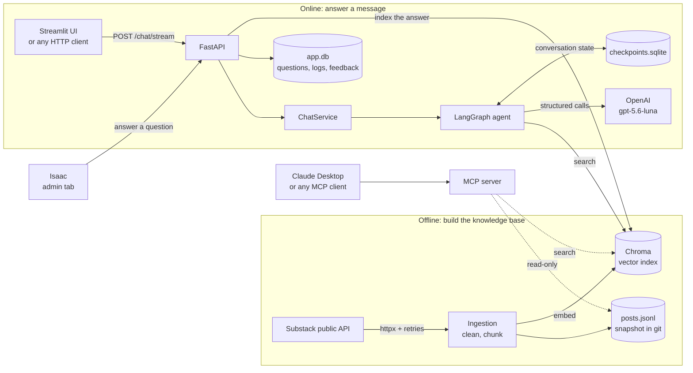
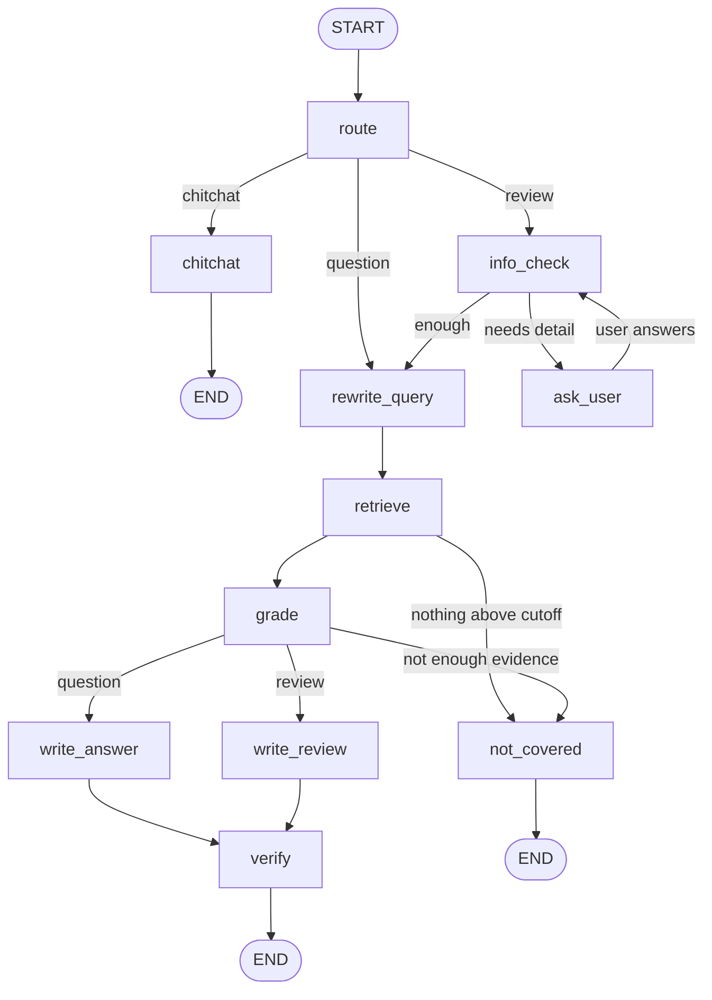

# Architecture

This page explains how the system is put together and how one message travels through it. Read
the README first for the big picture.

## The system at a glance



Two separate worlds. **Offline**, a command downloads the newsletter and builds the search index.
**Online**, a web server answers messages using that index. They meet only at the data folder.

## Layers, and the rule that keeps them clean

```
cli.py, api/routes/, ui/        <- entry points: parse input, call a service, format output
        |
agent/service.py                <- ChatService: run one turn, read the reply, count tokens
        |
agent/graph.py + nodes.py       <- the decision logic (LangGraph)
        |
retrieval/, db/, agent/llm.py   <- adapters to the outside world: Chroma, SQLite, OpenAI
        |
domain/                         <- plain data shapes (Pydantic). Depends on nothing else.
```

**The rule: dependencies point downward only.** `domain/` imports nothing from the project.
The agent never imports FastAPI. The API never builds prompts. This is why the same `ChatService`
serves both the API and the command line.

The agent also reaches OpenAI only through `OpenAIClient` (in `agent/llm.py`) and the search index
only through `VectorIndex` (in `retrieval/index.py`). Both are passed in when the agent is built
(in `agent/factory.py`), so the rest of the code does not need to know how they work.

## One message, step by step

A reader asks: *"When should I use a dual axis chart?"*

| # | Where | What happens |
|---|---|---|
| 1 | `api/main.py` | Middleware gives the request an id. CORS is checked. |
| 2 | `api/routes/chat.py` | The rate limiter runs. Pydantic validates the body (length, thread id format). |
| 3 | `agent/service.py` | Is this thread paused waiting for an answer? No, so it starts a new turn. |
| 4 | `route` node | One small model call classifies the message: question, review, or chitchat. |
| 5 | `rewrite_query` | A first question is already a good query, so no model call is made. |
| 6 | `retrieve` node | The query is embedded and Chroma returns the 6 nearest chunks. Anything below the 0.35 similarity cutoff is dropped. |
| 7 | `grade` node | A model call sees the question and the chunks and returns which ones help, and whether they are enough. **If not enough, the flow jumps to a refusal.** |
| 8 | `write_answer` | A model call writes the answer and proposes 1 to 4 quotes, in a Pydantic schema. |
| 9 | `verify` node | **Plain code, no model.** Each quote must appear word for word in the chunk it cites. Invented quotes are dropped. If none survive, the reply becomes a refusal. |
| 10 | `service.py` | Reads the final reply from the saved state and adds up tokens and cost. |
| 11 | `api/routes/chat.py` | Logs the turn to SQLite and returns the reply as JSON or as streamed events. |

Steps 6, 7 and 9 are three independent layers of "refuse if unsure". Each catches failures the
others miss.

## The LangGraph agent



* **State** (`agent/state.py`) is a dictionary of plain JSON values. It is saved to disk after
  every step by the checkpointer, so it cannot hold Python objects. Nodes store `model_dump()`
  dicts and rebuild typed models with `model_validate()` when they need them.
* **Memory between turns** comes from the `messages` list and the checkpointer. A `thread_id`
  names a conversation. The per-turn fields (`intent`, `candidates`, `reply`...) are reset by the
  `route` node at the start of each turn so nothing leaks from the previous turn.
* **Pausing** (`ask_user`) uses `interrupt()`. The graph stops, its state is saved, and the API
  returns a `needs_input` reply. The next message on the same thread resumes the graph. On resume
  the paused node runs again from its first line, so code before `interrupt()` must be free of side
  effects.
* **Reviews** search once per aspect of the user's work and merge the results. A single blended
  query finds only the most obvious principle.

## Data, and where each piece lives

| Data | Stored in | Why there |
|---|---|---|
| Newsletter posts (raw) | `data/raw/posts.jsonl`, **committed to git** | Lets the index be rebuilt offline, and works if Substack changes its API |
| Chunk vectors and text | `data/chroma/` (rebuilt by `ingest`) | Needs a vector index for similarity search |
| Questions, logs, feedback | `data/app.db` (SQLite) | Relational data you want to query with SQL |
| Conversation state (all messages, including submitted work) | `data/checkpoints.sqlite` | Owned by LangGraph. Lets threads continue and survive a restart |
| Isaac's answers | Chroma (`source_type="isaac_answer"`) and `open_questions` table | Searchable like a post, and tracked like a ticket |

## Error handling and security

* **Model provider down:** `openai.OpenAIError` becomes a clean `502` with a request id.
* **Any other bug:** logged with a full traceback, but the client only sees a generic `500` and
  the request id. Internals are never leaked.
* **Stalled model requests:** short timeouts with retries (see `agent/llm.py`). Stalls of 40 to 60
  seconds were observed in roughly 10 to 25 percent of requests; a short timeout reduces each to a
  few seconds.
* **Admin endpoints:** require an `X-API-Key` header, compared in constant time. With no key
  configured they return `503`, so they fail closed.
* **Rate limiting:** a sliding window per client address, because every chat costs real money.
  It lives in memory, so it suits one server process. Several servers would need Redis.
* **Secrets:** read from the environment by `config.py` and stored as `SecretStr`, so they do not
  appear in logs. `.env` is ignored by git and by the Docker build.
* **Privacy and retention:** what is stored, and where.
  * *Conversation state* (every message in a thread, including descriptions of work submitted for
    review) is checkpointed to `data/checkpoints.sqlite` so a conversation can continue.
  * It is bounded two ways: `DELETE /chat/{thread_id}` removes a thread (the UI's "New
    conversation" calls it), and `isaac-says purge-threads` deletes threads idle for more than
    `THREAD_RETENTION_DAYS` (default 30).
  * *The question queue* (`open_questions`) only receives plain questions that could not be
    answered, stored in resolved form, and the reply tells the user. Review descriptions are never
    copied into the queue or the usage log.
  * The usage log records timing, token counts and outcome, not message text.

## What would change to scale it up

This is a single-process design that runs comfortably on one small machine. To serve many users:
move SQLite to Postgres (only `db/` and the checkpointer change), move the rate limiter to Redis,
and run several API containers behind a load balancer. The layering above is what makes those
swaps local.
